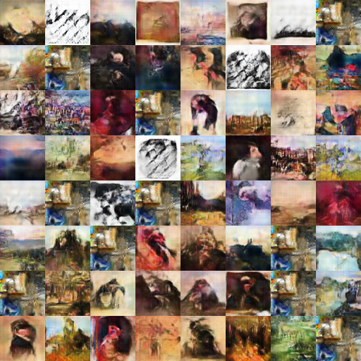

# MLGAN
Multi label DCGAN. The code highly borrowed from carpedm20's DCGAN

 

Get data from wikiart (using [Lucas David's wikiart](https://github.com/lucasdavid/wikiart))

`sh get_dataset.sh`

Training

`sh run.sh`

By some experiments, weight must lower than 1 (recommand to near 0.01). Otherwise, model collapse occurs.
